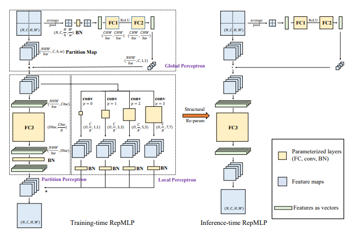

# RepMLP-pytorch
  Pytorch implemention of [RepMLP: Re-parameterizing Convolutions into Fully-connected Layers for Image Recognition](https://arxiv.org/pdf/2105.01883v1.pdf)

### Overview




### Usage

```python
import torch
from torch import nn
from repmlp-pytorch import RepMLP
N=4
C=512
O=1024
H=14
W=14
h=7
w=7
fc1_fc2_reduction=1
fc3_groups=8
repconv_kernels=[1,3,5,7]
repmlp=RepMLP(C,H,W,h,w,fc1_fc2_reduction,fc3_groups,repconv_kernels=repconv_kernels)
x=torch.randn(N,C,H,W)
y=repmlp(x)
```

