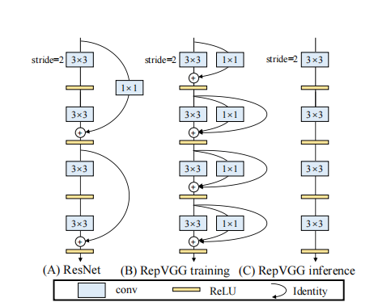

# RepMLP-pytorch
  Pytorch implemention of [RepMLP: Re-parameterizing Convolutions into Fully-connected Layers for Image Recognition](https://arxiv.org/pdf/2105.01883v1.pdf)

  Pytorch implemention of [RepVGG: Making VGG-style ConvNets Great Again](https://arxiv.org/abs/2101.03697)

  We add some annotations to make code easy to read !!!

  Noting that dimention of input features $N$ should equal to dimention of output features $O$. Otherwise, the results of inference and training will be different !!!

### Overview


### RepMLP Usage

```python
import torch
from torch import nn
from repmlp-pytorch import RepMLP

N=4 #batch size
C=512 #input dim
O=1024 #output dim
H=14 #image height
W=14 #image width
h=7 #patch height
w=7 #patch width
fc1_fc2_reduction=1 #reduction ratio
fc3_groups=8 # groups
repconv_kernels=[1,3,5,7] #kernel list
repmlp=RepMLP(C,H,W,h,w,fc1_fc2_reduction,fc3_groups,repconv_kernels=repconv_kernels)
x=torch.randn(N,C,H,W)
y=repmlp(x)
```

### RepVGG Usage




```python

import torch
from torch import nn
from repvgg-pytorch import RepBlock

input=torch.randn(50,512,49,49)
repblock=RepBlock(512,512)
repblock.eval()
out=repblock(input)
repblock._switch_to_deploy()
out2=repblock(input)
print('difference between vgg and repvgg')
print(((out2-out)**2).sum())

```


### Reference

[Official RepMLP](https://github.com/DingXiaoH/RepMLP/blob/main/repmlp.py)

[Official RepVGG](https://github.com/DingXiaoH/RepVGG)